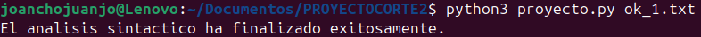
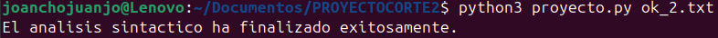
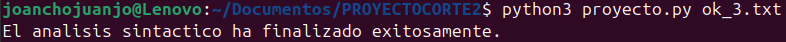
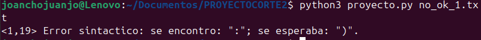
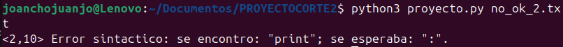
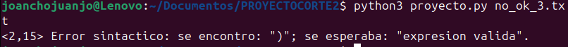

# Analizador-Lexico

### Descripción General

El objetivo de este proyecto es desarrollar un analizador sintáctico del lenguaje Python en su versión simplificada, sin usar librerías externas como PLY o ANTLR.

El programa recibe un archivo de entrada con código fuente (.txt), realiza el análisis léxico y sintáctico, y genera una linea de texto con el resultado del proceso.

El sistema detecta errores sintácticos en el código y los reporta en el formato exigido por el profesor:

<pre><línea,col> Error sintactico: se encontro: "token_incorrecto"; se esperaba: "token_esperado".</pre>

Si el análisis finaliza correctamente, el resultado es:

<pre>El analisis sintactico ha finalizado exitosamente.</pre>

### Definición de Componentes

#### Análisis Lexico 

El analizador léxico es la primera parte del compilador.
Su función es recorrer el texto carácter por carácter, separando palabras, símbolos, operadores y números en una lista de tokens.

Cada token contiene su texto, línea y columna, lo que permite ubicar errores con precisión.

En este proyecto se implementa con la función separar_tokens()

```python
def separar_tokens(texto):
    tokens = []
    palabra = ""
    linea = 1
    columna = 1
    pos = 0
    while pos < len(texto):
        caracter = texto[pos]

        # Salto de línea
        if caracter == "\n":
            linea += 1
            columna = 1
            if palabra:
                tokens.append((palabra, linea, columna))
                palabra = ""
            pos += 1
            continue

        # Espacio o tabulación
        if caracter in [" ", "\t"]:
            if palabra:
                tokens.append((palabra, linea, columna))
                palabra = ""
            columna += 1
            pos += 1
            continue

        # Cadenas entre comillas simples o dobles
        if caracter in ['"', "'"]:
            comilla = caracter
            inicio_col = columna
            cadena = comilla
            pos += 1
            columna += 1
            while pos < len(texto) and texto[pos] != comilla:
                if texto[pos] == "\n":
                    linea += 1
                    columna = 1
                cadena += texto[pos]
                pos += 1
                columna += 1
            if pos < len(texto):
                cadena += comilla
                pos += 1
                columna += 1
            else:
                raise Exception(f'<{linea},{inicio_col}> Error sintactico: cadena sin cerrar.')
            tokens.append((cadena, linea, inicio_col))
            palabra = ""
            continue

        # Operadores dobles
        if texto[pos:pos+2] in ["==", "!=", "<=", ">=", "**", "//"]:
            if palabra:
                tokens.append((palabra, linea, columna))
                palabra = ""
            tokens.append((texto[pos:pos+2], linea, columna))
            columna += 2
            pos += 2
            continue

        # Símbolos individuales
        if caracter in SIMBOLOS:
            if palabra:
                tokens.append((palabra, linea, columna))
                palabra = ""
            tokens.append((caracter, linea, columna))
            columna += 1
            pos += 1
            continue

        # Acumular palabra o número
        palabra += caracter
        columna += 1
        pos += 1

    if palabra:
        tokens.append((palabra, linea, columna))
    tokens.append(("EOF", linea, columna))
    return tokens
```

Explicación

- Recorre el texto sin usar expresiones regulares.
- Detecta palabras reservadas, operadores y delimitadores.
- Guarda la posición del error si ocurre.
- Agrega un token final "EOF" para marcar el fin del archivo.

#### Análisis Sintáctico

El analizador sintáctico revisa si la secuencia de tokens cumple con las reglas gramaticales del lenguaje.
Se implementa mediante la clase Analizador, que usa métodos recursivos para validar estructuras como funciones, ciclos, condicionales, clases, expresiones, etc.

```python
class Analizador:
    def __init__(self, tokens):
        self.tokens = tokens
        self.pos = 0

    def actual(self):
        return self.tokens[self.pos][0]
    def linea(self):
        return self.tokens[self.pos][1]
    def columna(self):
        return self.tokens[self.pos][2]
    def avanzar(self):
        self.pos += 1

    def coincidir(self, esperado):
        if self.actual() == esperado:
            self.avanzar()
        else:
            raise Exception(f'<{self.linea()},{self.columna()}> Error sintactico: se encontro: "{self.actual()}"; se esperaba: "{esperado}".')

    def programa(self):
        while self.actual() != "EOF":
            self.sentencia()

    def sentencia(self):
        token = self.actual()
        if token == "def":
            self.def_funcion()
        elif token == "class":
            self.def_clase()
        elif token == "if":
            self.condicional()
        elif token == "elif" or token == "else":
            self.avanzar()
            self.coincidir(":")
            self.sentencia()
        elif token == "for":
            self.ciclo_for()
        elif token == "while":
            self.ciclo_while()
        elif token == "try":
            self.bloque_try()
        elif token == "except" or token == "finally":
            self.avanzar()
            if self.actual() == ":":
                self.avanzar()
                self.sentencia()
        elif token == "print" or token == "input":
            self.sentencia_funcion()
        elif token == "return":
            self.sentencia_return()
        elif token == "pass":
            self.avanzar()
        elif token == "break" or token == "continue":
            self.avanzar()
        elif token.isidentifier():
            self.sentencia_asignacion_o_expresion()
        elif token == "EOF":
            return
        else:
            raise Exception(f'<{self.linea()},{self.columna()}> Error sintactico: se encontro: "{token}"; se esperaba: "def", "class", "if", "elif", "else", "for", "while", "print", "input" o "return".')

    def sentencia_asignacion_o_expresion(self):
        nombre = self.actual()
        self.avanzar()
        if self.actual() == "=":
            self.avanzar()
            self.expresion()
        elif self.actual() in ["+", "-", "*", "/", "%", "==", "!=", "<=", ">=", "<", ">", "and", "or"]:
            self.avanzar()
            self.expresion()
        else:
            return

    def def_funcion(self):
        self.coincidir("def")
        nombre = self.actual()
        if not nombre.isidentifier():
            raise Exception(f'<{self.linea()},{self.columna()}> Error sintactico: se encontro: "{nombre}"; se esperaba: "nombre de funcion".')
        self.avanzar()
        self.coincidir("(")
        if self.actual() != ")":
            self.parametros()
        self.coincidir(")")
        self.coincidir(":")
        self.sentencia()

    def def_clase(self):
        self.coincidir("class")
        nombre = self.actual()
        if not nombre.isidentifier():
            raise Exception(f'<{self.linea()},{self.columna()}> Error sintactico: se encontro: "{nombre}"; se esperaba: "nombre de clase".')
        self.avanzar()
        if self.actual() == "(":
            self.avanzar()
            self.expresion()
            self.coincidir(")")
        self.coincidir(":")
        self.sentencia()

    def parametros(self):
        while True:
            nombre = self.actual()
            if not nombre.isidentifier():
                raise Exception(f'<{self.linea()},{self.columna()}> Error sintactico: se encontro: "{nombre}"; se esperaba: "identificador".')
            self.avanzar()
            if self.actual() == ",":
                self.avanzar()
                continue
            else:
                break

    def condicional(self):
        self.coincidir("if")
        self.expresion()
        self.coincidir(":")
        self.sentencia()
        while self.actual() == "elif":
            self.avanzar()
            self.expresion()
            self.coincidir(":")
            self.sentencia()
        if self.actual() == "else":
            self.avanzar()
            self.coincidir(":")
            self.sentencia()

    def ciclo_for(self):
        self.coincidir("for")
        variable = self.actual()
        if not variable.isidentifier():
            raise Exception(f'<{self.linea()},{self.columna()}> Error sintactico: se encontro: "{variable}"; se esperaba: "identificador".')
        self.avanzar()
        self.coincidir("in")
        self.expresion()
        self.coincidir(":")
        self.sentencia()

    def ciclo_while(self):
        self.coincidir("while")
        self.expresion()
        self.coincidir(":")
        self.sentencia()

    def bloque_try(self):
        self.coincidir("try")
        self.coincidir(":")
        self.sentencia()
        if self.actual() == "except":
            self.avanzar()
            if self.actual().isidentifier():
                self.avanzar()
            self.coincidir(":")
            self.sentencia()
        if self.actual() == "finally":
            self.avanzar()
            self.coincidir(":")
            self.sentencia()

    def sentencia_funcion(self):
        nombre = self.actual()
        self.avanzar()
        self.coincidir("(")
        if self.actual() != ")":
            self.expresion()
        self.coincidir(")")

    def sentencia_return(self):
        self.coincidir("return")
        if self.actual() not in [":", "EOF"]:
            self.expresion()

    def expresion(self):
        token = self.actual()
        if token.isidentifier() or token.isnumeric() or token in ["True", "False", "None"] or (
            (token.startswith('"') and token.endswith('"')) or (token.startswith("'") and token.endswith("'"))
        ):
            self.avanzar()
            if self.actual() in ["+", "-", "*", "/", "%", "==", "!=", "<=", ">=", "<", ">", "and", "or"]:
                self.avanzar()
                self.expresion()
        elif token == "(":
            self.avanzar()
            self.expresion()
            self.coincidir(")")
        elif token == "[":
            self.avanzar()
            if self.actual() != "]":
                self.expresion()
                while self.actual() == ",":
                    self.avanzar()
                    self.expresion()
            self.coincidir("]")
        elif token == "{":
            self.avanzar()
            if self.actual() != "}":
                self.expresion()
                self.coincidir(":")
                self.expresion()
            self.coincidir("}")
        else:
            raise Exception(f'<{self.linea()},{self.columna()}> Error sintactico: se encontro: "{token}"; se esperaba: "expresion valida".')
```

Explicación:

- Cada método valida un tipo de instrucción.
- Si algo no coincide, genera un error con la posición exacta.
- El programa se detiene en el primer error.

### Reglas Gramaticales

<pre>
PROGRAMA   → SENTENCIA*
SENTENCIA   → DEF_FUNCION | CLASE | IF | FOR | WHILE | PRINT | INPUT | RETURN | EXPRESION
DEF_FUNCION   → "def" ID "(" PARAMS ")" ":" SENTENCIA
CLASE   → "class" ID ( "(" EXPRESION ")" )? ":" SENTENCIA
IF   → "if" EXPRESION ":" SENTENCIA ( "elif" EXPRESION ":" SENTENCIA )* ( "else" ":" SENTENCIA )?
FOR   → "for" ID "in" EXPRESION ":" SENTENCIA
WHILE   → "while" EXPRESION ":" SENTENCIA
EXPRESION   → ID | NUM | (EXPRESION OPERADOR EXPRESION) | (EXPRESION) | [LISTA] | {DICCIONARIO}
</pre>
Estas reglas representan una versión reducida de la gramática de Python.
Se permite el uso de expresiones aritméticas, listas, diccionarios y estructuras de control.
</pre>

### Pruebas de Funcionamiento

#### Funcionamiento Correcto

##### Ejemplo 1:

```python
def sumar(a, b):
    print(a + b)
    return a + b
```


##### Ejemplo 2:

```python
if True:
    numeros = [1, 2, 3]
    print(numeros)
else:
    print("lista vacia")
```



##### Ejemplo 3: 

```python
class Persona:
    def __init__(self, nombre):
        print(nombre)

for i in [1, 2, 3]:
    print(i)
```



#### Manejo de Errores:

##### Ejemplo 1:

```python3
def contains(items:[int ,]
```



##### Ejemplo 2:

```python3
if True
    print("ok")
```



##### Ejemplo 3: 

```python3
def sumar(a, b):
    print(a + )
```



### Conclusiones

El proyecto desarrollado demuestra el funcionamiento interno de un analizador sintáctico construido completamente desde cero, sin el uso de librerías externas. A través de programación pura, se implementaron las etapas fundamentales de un compilador: el análisis léxico y el análisis sintáctico.

El analizador es capaz de identificar correctamente estructuras del lenguaje Python como funciones, clases, condicionales, ciclos, listas, diccionarios, cadenas de texto y operadores. Además, detecta y reporta con precisión los errores sintácticos, indicando la línea, columna y el símbolo inesperado, tal como lo hacen los compiladores reales.

Con este trabajo se comprendió de manera práctica cómo los lenguajes de programación procesan su código internamente, fortaleciendo el entendimiento de las fases de traducción, la estructura de la gramática y la importancia del manejo de errores en la validación de programas.

